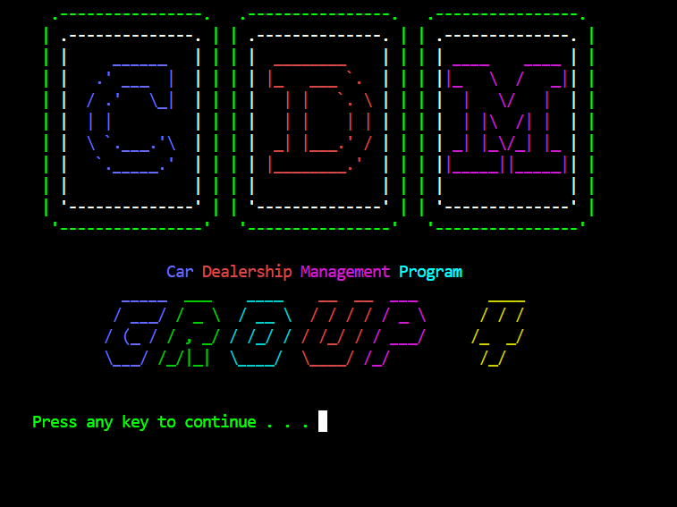
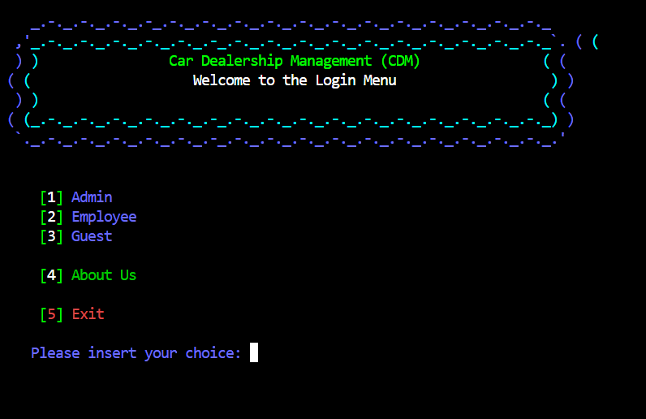
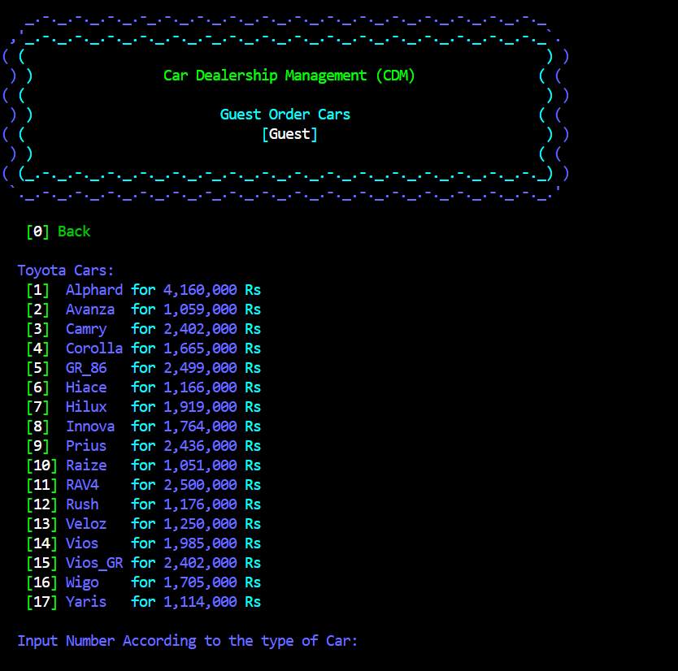

# 🚗 Car Dealership Management Program

This project, developed as part of the **Fundamentals of Programming** course, is a **console-based C++ application** that simulates a basic **car dealership management system**. The system allows users to perform key operations such as:

- Adding new cars to the inventory  
- Modifying or deleting existing car records  
- Exporting order logs  
- Viewing available models  
- User authentication (Admin & Guest access)

---

## 💡 Programming Paradigms & Principles Used

- Object-Oriented Programming (OOP)  
- Code Reusability  
- Procedural Programming  
- File Handling  

---

## 🧑‍💻 How to Use

1. **Login**:
   - On launch, you’ll be prompted to log in.
   - If you don’t have an account, use the **Guest** option to continue with limited access.

2. **Guest Users Can**:
   - View available Toyota cars  
   - Place orders

3. **Admin Users Can**:
   - Add, modify, or delete car records  
   - View/export order logs  
   - Perform administrative management tasks

---

## 🔐 Login Credentials

###  Admin Access
| Username | Password |
|----------|----------|
| Anant    | Patil   |

###  Employee Access
| Username | Password |
|----------|----------|
| Miku     | Miku     |

---

## 🛠️ Requirements

-  Microsoft Visual Studio 2019 or higher  
-  OR g++ Compiler (MinGW 6.3.0 or newer)

---

## 🖥️ Setup Instructions

###  To Build & Run

####  Option 1: Using Precompiled Executable
1. Download the ZIP or clone the repository.  
2. Open the extracted folder.  
3. Run `CarDealership.exe` to start the program.

####  Option 2: Build Using g++
```bash
g++ CarDealerShip.cpp -o CarDealership.exe
./CarDealership.exe
```

---

## 🖼️ Screenshots

> Add these images in a `screenshots/` folder if you're uploading to GitHub.

###    First Page


### 🔹 Main Menu


### 🔹 Car Entry Panel


---

## 🙋 Author

**👨‍💻 Anant Patil**  
This project demonstrates my understanding of C++ fundamentals, object-oriented design, file handling, and console application development.

Feel free to explore, modify, and enhance the program!

---

## 📜 License

This project is free to use, modify, and share for educational and personal purposes.

